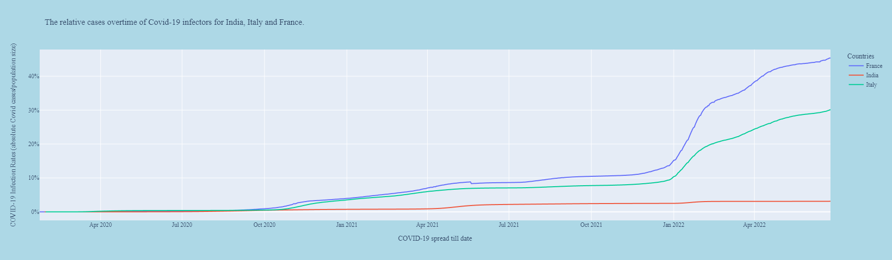
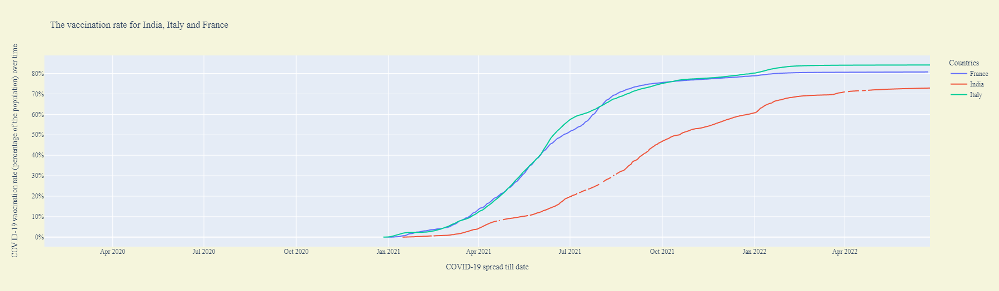
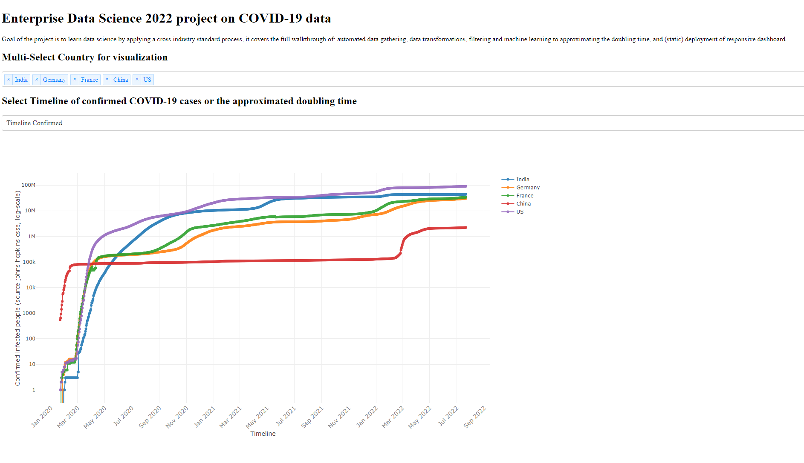
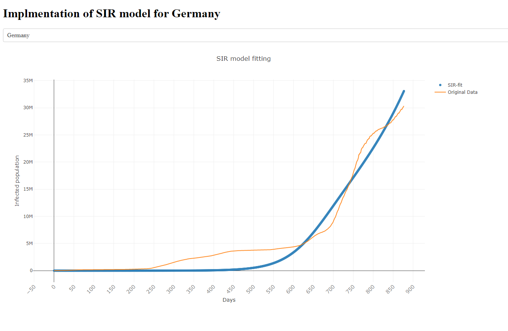

# Enterprise Data Science 2022 course on COVID-19 data

Delivery 1 : Figure 1  The relative cases overtime of Covid infectors (absolute Covid cases/population size)

Delivery 2 : Figure 2 The vaccination rate (percentage of the population) over time

Delivery 3 : Figure 3 COVID-19 dashboard having Timeline of confirmed COVID-19 cases or the approximated doubling time

Delivery 4 : Figure 4 Implementation of SIR model for Germany. 
